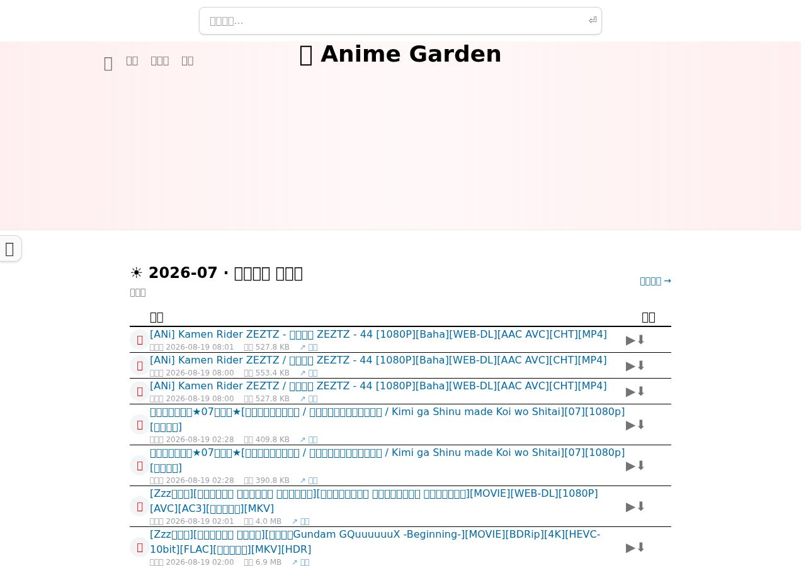

# 🌸 dmbt-web

[](https://github.com/Mogvl/dmbt-web/actions/workflows/ci.yml)
[](https://github.com/Mogvl/dmbt-web/actions/workflows/docker-images.yml)

[English](/README.en.md) | [简体中文](/README.md)

A **Go + Vue reimplementation** of [AnimeGarden](https://github.com/yjl9903/AnimeGarden) — third-party mirror site of [動漫花園](https://share.dmhy.org/) and anime BT resource aggregator. The API is wire-compatible with the original `api.animes.garden`.

- Frontend: http://localhost:9700
- Backend API: http://localhost:9701

+ ☁️ Open [API](http://localhost:9700/docs/api) for developers, wire-compatible with the original
+ 📺 Browse the [anime broadcast schedule](http://localhost:9700/anime) to find anime you like
+ 🔖 Rich advanced search, e.g.: `葬送的芙莉莲 +简体内嵌 字幕组:桜都字幕组 类型:动画`
+ 📙 Custom RSS feeds, e.g.: [葬送的芙莉莲](http://localhost:9700/feed.xml?search=%E8%91%AC%E9%80%81%E7%9A%84%E8%8A%99%E8%8E%89%E8%8E%B2)
+ ⭐ Save search conditions as collections and get aggregated RSS feeds
+ ✈️ Four upstream crawlers: [動漫花園](https://share.dmhy.org/), [蜜柑计划](https://mikanani.me/), [萌番组](https://bangumi.moe/), [ANi](https://open.ani.rip/)

[](http://localhost:9700/resources/1)

## Using Skills

**Anime Garden skill**: search anime resources from your self-hosted instance (shipped in this repo).

**Yuc's Anime List skill**: retrieve quarterly anime lineups from yuc.wiki.

Both skills ship with this repository (`skills/animegarden`, `skills/yuc`). Install with the Vercel skills CLI:

```bash
npx skills add https://github.com/Mogvl/dmbt-web --skill animegarden
npx skills add https://github.com/Mogvl/dmbt-web --skill yuc
```

OpenClaw and similar clients can also mount the `skills/animegarden` and
`skills/yuc` directories directly.

**Design taste skills**: frontend design-style skills bundled from
[taste-skill](https://github.com/Leonxlnx/taste-skill) (MIT) under
`skills/taste-skill/` (brandkit, gpt-taste, image-to-code,
imagegen-frontend-*, minimalist, output, redesign, soft, stitch,
taste-skill v1 + v2). Install names are the `name:` fields in each
`SKILL.md`.

The `animegarden` skill's API base is configured via `ANIMEGARDEN_API_BASE`
(default `http://localhost:9701`; point it at your deployment after Docker
Compose, e.g. `https://anime.example.com:9701`).

## Using MCP

MCP endpoint: `http://localhost:9701/mcp`.

Add this to your MCP client:

```json
{
  "mcpServers": {
    "animegarden": {
      "url": "http://localhost:9701/mcp"
    }
  }
}
```

## Using the Open API

```bash
curl "http://localhost:9701/resources?page=1&pageSize=10"
```

Interactive Open API docs: http://localhost:9700/docs/api. The original repo's [examples/api.http](https://github.com/yjl9903/AnimeGarden/blob/main/examples/api.http) applies as well.

You can also use the website directly — the resource list page lets you copy generated cURL, JavaScript and Python request code.

## Using the npm package

The API is compatible with the original [@animegarden/client](https://www.npmjs.com/package/animegarden) — point its `baseURL` at your instance:

```bash
npm i @animegarden/client
```

```ts
import { fetchResources } from '@animegarden/client'

// Fetch the first page of your Anime Garden instance
const resources = await fetchResources({ baseURL: 'http://localhost:9701' })

// Fetch all the resources which match some filter conditions
const sakurato = await fetchResources({ baseURL: 'http://localhost:9701', count: -1, fansub: 'ANi' })
```

A built-in [Fetch](https://developer.mozilla.org/en-US/docs/Web/API/Fetch_API/Using_Fetch) is required; polyfill with [undici](https://github.com/nodejs/undici) or [ofetch](https://github.com/unjs/ofetch) otherwise.

## Embedding

Copy the embed code from the resource search page into your blog or site:

```html
<iframe src="//localhost:9700/iframe?type=动画" width="100%" height="600" frameborder="0"></iframe>
```

## One-click deploy (Docker Compose)

Images are built and published to GHCR on every push to `main`:

```bash
curl -O https://raw.githubusercontent.com/Mogvl/dmbt-web/main/docker-compose.yml
docker compose up -d
# open http://localhost:9700 ; data persists in ./data (SQLite)
```

| Service | Image | Ports | Notes |
|---|---|---|---|
| `dmbt-web` | `ghcr.io/mogvl/dmbt-web/web:latest` | `9700:80` | nginx-served frontend, same-origin API/RSS proxy |
| `dmbt-server` | `ghcr.io/mogvl/dmbt-web/server:latest` | internal 9701 | Go API + crawler scheduler, `DATA_DIR=/data` |

Server env vars: `PORT` (default 9701), `DATA_DIR` (default `/data`), `CRON` (default true), `APP_HOST`, `TELEGRAM_TOKEN` / `TELEGRAM_CHAT_ID`, `SCRAPE_PAGE_DELAY_MS` / `MAX_FETCH_PAGES`.

> The container runs as a non-root user; the entrypoint auto-`chown`s the data
> directory, so a host-created root-owned `./data` bind mount just works.
> Images are multi-arch (amd64 + arm64).

Local image builds:

```bash
docker build -t ghcr.io/mogvl/dmbt-web/server:latest ./server
docker build -t ghcr.io/mogvl/dmbt-web/web:latest ./web
```

## Local development

### Backend (Go, port 9701)

```bash
cd server
go run ./cmd/server
```

| Variable | Default | Purpose |
|---|---|---|
| `PORT` | `9701` | HTTP listen port |
| `DATA_DIR` | `data` | SQLite data directory (relative to the working directory) |
| `APP_HOST` | `animes.garden` | site host used in feed/detail URLs |
| `CRON` | `true` | enable the scheduler (fetch every 5 min, sync hourly, calendar hourly) |
| `TELEGRAM_TOKEN` / `TELEGRAM_CHAT_ID` | — | Telegram push |
| `SCRAPE_PAGE_DELAY_MS` | `800` | politeness delay between upstream pages |
| `MAX_FETCH_PAGES` | `200` | per-run fetch walk cap (history catch-up) |

On first boot the crawlers walk upstream history page by page in the background (the original pre-seeds this data). The API works immediately and fills up over time.

### Frontend (Vue, port 9700)

```bash
cd web
npm install
npm run dev      # dev server with HMR, proxies API to :9701
npm run build    # production build
npm run preview  # production preview (same port/proxy config)
```

## Architecture

```
server/   Go 1.25 backend (port 9701)
  cmd/server            entrypoint
  internal/api          HTTP handlers (Hono-route parity), bgm mirror proxy
  internal/scraper      dmhy / moe / mikan / ani fetchers + parsers
  internal/anipar       anime title parser (Go port, 12,356 fixture tests pass)
  internal/search       jieba tokenizer (vendored jiebago + embedded dict)
  internal/zh           traditional→simplified + fullwidth→halfwidth (simptrad port)
  internal/query        filter → SQL (SQLite port of the Postgres schema)
  internal/resources    upsert / dedup / details store
  internal/subjects     bangumi calendar sync (bgm.animes.garden)
  internal/collections  collection store + ohash/SHA-1 hashing
  internal/rss,sitemap, mcp, push, jobs, db, config, model, filter

web/      Vue 3 + Vite + Tailwind v4 frontend (port 9700)
  src/api/client.ts     @animegarden/client port (parse/stringify search params)
  src/utils             search syntax, code generators, dates, constants
  src/stores            theme / sidebar / histories / fansubs / collections (IndexedDB)
  src/layouts           hero + header + cmdk-style search + sidebar + footer
  src/pages             home / resources / subject / anime calendar / collection /
                        detail (file tree) / docs api / iframe / about
```

## Related projects

+ [AnimeGarden](https://github.com/yjl9903/AnimeGarden): the original project this repo reimplements
+ [AnimeSpace](https://github.com/yjl9903/AnimeSpace): Keep following your favourite anime
+ [anipar](https://github.com/yjl9903/AnimeGarden/tree/main/packages/anipar): Parse structure metadata from resource's title.

## Credits

+ [AnimeGarden](https://github.com/yjl9903/AnimeGarden) — the original project and design reference
+ [動漫花園](https://share.dmhy.org/)
+ [蜜柑计划](https://mikanani.me/)
+ [萌番组](https://bangumi.moe/)
+ [ANi](https://open.ani.rip/)
+ [Bangumi 番组计划](https://bgm.tv/)
+ [bangumi-data](https://github.com/bangumi-data/bangumi-data)

## License

AGPL-3.0 License © 2025 [Mogvl](https://github.com/Mogvl) (reimplementation of [AnimeGarden](https://github.com/yjl9903/AnimeGarden), AGPL-3.0)